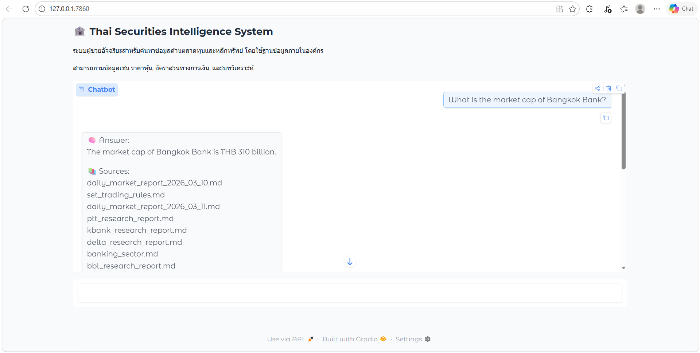

# 🏦 Thai Securities Intelligence Q&A System

ระบบถาม-ตอบอัจฉริยะสำหรับค้นหาข้อมูลตลาดทุนไทยจากเอกสารภายในองค์กร โดยใช้เทคนิค Retrieval-Augmented Generation (RAG)

---

## ✨ Features
- 🔍 ค้นหาข้อมูลเชิงความหมายจากเอกสารการเงิน
- 🧠 ตอบคำถามด้วย LLM โดยอ้างอิง context จริง
- 📚 แสดงแหล่งที่มาของข้อมูล (Source Attribution)
- ⚡ ใช้งานผ่าน Web UI (Gradio)
- 📊 รองรับข้อมูลหุ้น, รายงานตลาด, และกฎระเบียบ

---

## ⚙️ Installation
```bash
git clone https://github.com/your-username/project.git
cd project

pip install -r requirements.txt


🚀 How to Run
py -3.11 app_ui.py
จากนั้นเปิด: http://127.0.0.1:7860


💬 Example Questions
- What is the recommendation for PTT stock? 
- What is the P/E ratio of Bangkok Bank? 
- Which stocks have Buy rating above 100 THB?

🏗️ System Architecture
User → Gradio UI → Query Engine → Retriever → Vector DB → LLM → Answer

⚙️ How It Works
- Documents are loaded from /data
- Text is split into chunks
- Embeddings are generated
- Query is matched using vector similarity
- Top-k results are sent to LLM
- Answer is generated with context
- Sources are returned for traceability

⚠️ Limitations
- ไม่มี real-time stock data
- คุณภาพขึ้นอยู่กับ embedding และ chunking
- อาจไม่ตอบคำถามเฉพาะทางบางกรณี
- ไม่มี multi-turn memory

🔮 Future Improvements
- Hybrid search (BM25 + Vector)
- Reranking model
- Citation highlighting
- Real-time financial data integration
- Multi-turn conversation support

🧑‍💻 Tech Stack
- Python
- Gradio
- LlamaIndex
- Embedding Model
- LLM (Groq)

👤 Author
- Name: Chomphunut Butrdee
- Email: chomphunutbutrdee2546@gmail.com

## 📸 Demo
